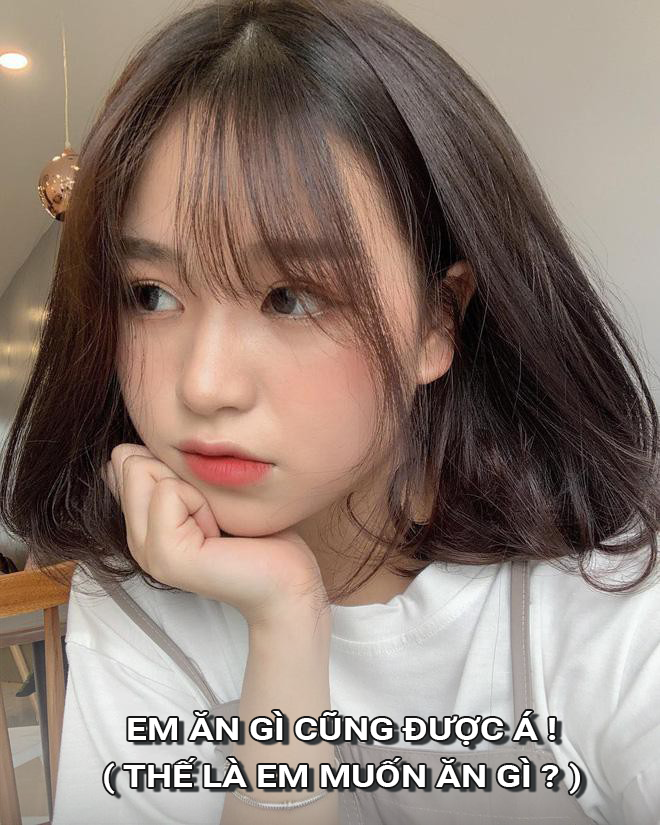
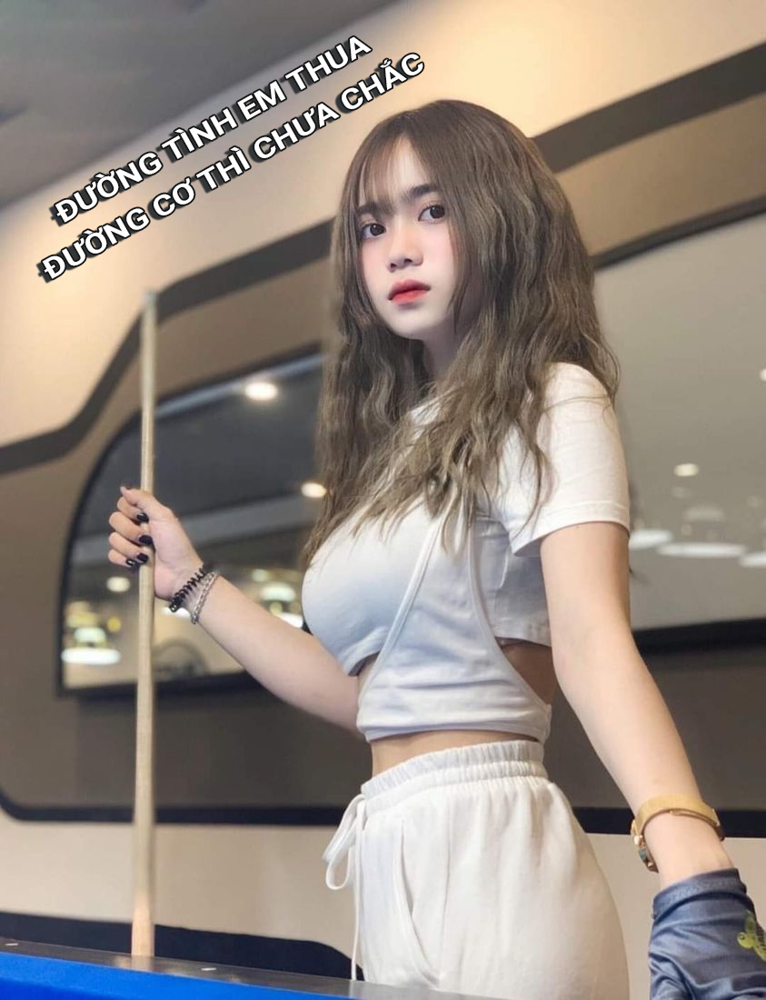
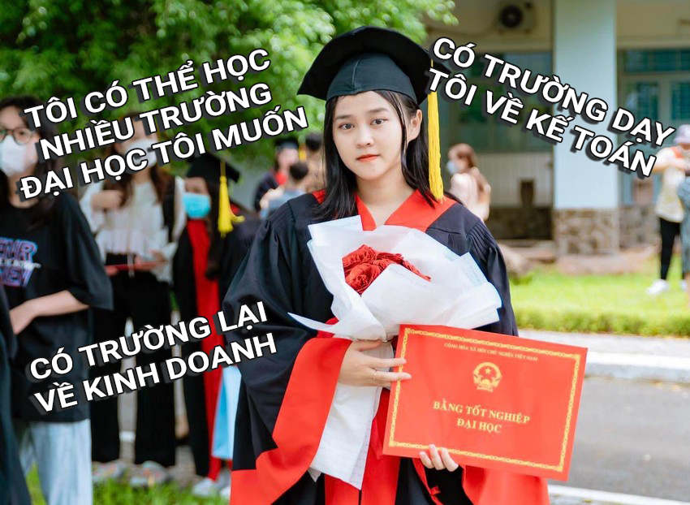

## Thực ra thì lập trình hướng đối tượng cũng không khó lắm đâu
Chúng ta hãy cùng hình dung về các cô gái của chúng ta cho dễ nhé

## Tính đóng gói
Các thông tin của các cô gái luôn là điều gì đó bí ẩn đối với chúng ta. Ai mà hiểu được con gái nghĩ gì chứ.

## Tính trừu tượng
Nếu bạn muốn biết thông tin gì đó về cô gái, chỉ khi họ cho bạn biết thì bạn mới biết thui á. Chứ ai mà cũng biết hết thì còn gì thú vị nữa.

## Tính kế thừa
Con gái nói chung đều là phụ nữ cả, họ đều có các đặc điểm giống nhau, dịu dàng này, xinh đẹp này, nụ cười nựa :))))

## Tính đa hình
Nói thì giống nhau thế thôi, chứ thực ra họ cũng có 1 vài điểm khác nhau đấy nhé. Gái ngoan thì có thể thích nấu ăn nè, thích ngồi ngắm ny chơi game nè. Còn gái hư thì đi bar nè, mẹ có đánh vào mông cũng phải đi phượt nè.

## Abstract class
Là một sự kết hợp giữa: base class, giúp cho các class con đỡ phải viết lại code (Don't repeat yourself) thay vào đó chỉ việc kế thừa, và interface giúp triển khai toàn bộ các property, method theo mẫu nhưng lại có sự lặp lại code. Có thể hiểu đó là 1 cô gái lúc thì hướng nội, lúc thì hướng ngoại

## Interface
Ngôn ngữ lập trình CSharp phản ánh đúng như ngoài đời thật. Chúng ta chỉ có thể dùng nó để kế thừa từ 1 class, nhưng lại có thể kế thừa từ nhiều Interface (interface là 1 hợp đồng) - nó không có đoạn mã thực thi code mà chỉ khai báo rằng những class kế thừa nó sẽ có những đặc điểm tính chất này.
Một cố gái chỉ có thể kế thừa đặc điểm, tính cách từ 1 người cha. Nhưng cô gái đó có thể tự học tập và rèn luyện tại nhiều trường đại học sau đó sẽ lấy được nhiều kiến thức chuyên ngành khác nhau. Những tấm bằng đại học đó sẽ luôn được công khai để mọi người có thể thấy rằng cô gái đó có thể làm được những gì.
