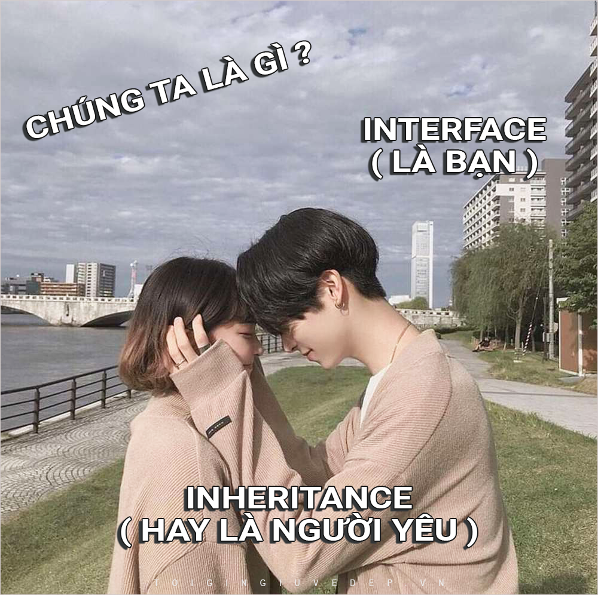

## Thực ra thì lập trình hướng đối tượng cũng không khó lắm đâu
Chúng ta hãy cùng hình dung về các cô gái của chúng ta cho dễ nhé

## Tính đóng gói
Các thông tin của các cô gái luôn là điều gì đó bí ẩn đối với chúng ta. Ai mà hiểu được con gái nghĩ gì chứ.

## Tính trừu tượng
Nếu bạn muốn biết thông tin gì đó về cô gái, chỉ khi họ cho bạn biết thì bạn mới biết thui á. Chứ ai mà cũng biết hết thì còn gì thú vị nữa.

## Tính kế thừa
Con gái nói chung đều là phụ nữ cả, họ đều có các đặc điểm giống nhau, dịu dàng này, xinh đẹp này, nụ cười nựa :))))

## Tính đa hình
Nói thì giống nhau thế thôi, chứ thực ra họ cũng có 1 vài điểm khác nhau đấy nhé. Gái ngoan thì có thể thích nấu ăn nè, thích ngồi ngắm ny chơi game nè. Còn gái hư thì đi bar nè, mẹ có đánh vào mông cũng phải đi phượt nè.

## Abstract class
Là một sự kết hợp giữa: base class, giúp cho các class con đỡ phải viết lại code (Don't repeat yourself) thay vào đó chỉ việc kế thừa, và interface giúp triển khai toàn bộ các property, method theo mẫu nhưng lại có sự lặp lại code. Có thể hiểu đó là 1 cô gái lúc thì hướng nội, lúc thì hướng ngoại

## Interface
Ngôn ngữ lập trình CSharp phản ánh đúng như ngoài đời thật. Chúng ta chỉ có thể dùng nó để kế thừa từ 1 class, nhưng lại có thể kế thừa từ nhiều Interface (interface là 1 hợp đồng) - nó không có đoạn mã thực thi code mà chỉ khai báo rằng những class kế thừa nó sẽ có những đặc điểm tính chất này.\
Một cố gái chỉ có thể kế thừa đặc điểm, tính cách từ 1 người cha. Nhưng cô gái đó có thể tự học tập và rèn luyện tại nhiều trường đại học sau đó sẽ lấy được nhiều kiến thức chuyên ngành khác nhau. Những tấm bằng đại học đó sẽ luôn được công khai để mọi người có thể thấy rằng cô gái đó có thể làm được những gì.

## Inheritance
hãy tự hỏi bản thân "What is the point" ?\
Inheritance kế thừa là khi bạn cho 1 class con thừa hưởng lại toàn bộ method, property của class cha ( cha có code gì con có code đấy )
Inheritance không phải là share code, nếu muốn share code thì có nhiều cách\
- Đặt code đó vào 1 class riêng và gọi class đó trong class
khác là được
- Dùng kế thừa khi mà có 1 mối quan hệ, ví dụ như class cat và class animal. Class car không thể là class con của class house  mặc dù nó cùng có thể có người bên trong. Cả class cha và class con phải có cùng logic => chỉ chia sẻ method signature và roperty là chưa đủ.
- Nếu chúng ta cứ phải override method ngay từ đầu, tại mọi class con thì việc tạo ra method gốc để làm gì.
- Kế thừa có thể khiến code ngày càng đi vào 1 góc, ví dụ phương tiện => xe => xe ô tô có động cơ => thuyền buồm k có động cơ => chúng ta sẽ có những method k dùng làm gì
những method k làm gì không nên được gọi. => chúng ta có những đoạn mã chủ động biết bị lỗi nếu chúng ta cứ phải override method ngay từ đầu, tại mọi class con thì việc tạo ra method gốc để làm gì. Thay vào đó hãy tách nó ra thành Interface, những class nào cần sẽ triển khai Interface đó.

Một cô gái có thể có nhiều bạn bè, nhưng chỉ có 1 người tâm đầu ý hợp !!! Bạn bè có thể là người có cùng tính cách với cô gái ấy, hoặc không ( họ có những Interface / bằng cấp / sở thích /... riêng ). Người yêu thì khác, one is enough, nếu có những đặc điểm tính cách ở 1 người là khác biệt với người còn lại thì 2 người đó không hợp nhau, không nên kế thừa chung 1 base class.

